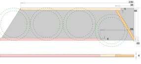

# beer_guide_in_fridge

This is a guide rail for beer cans in the refrigerator; it holds 4 cans and is FIFO (first in, first out), ejecting from the back.

## materials:
- 1.5set splittable wood chopsticks 
-  275x66mm thick paper
- woodworking bond

## Design

# Usecase

