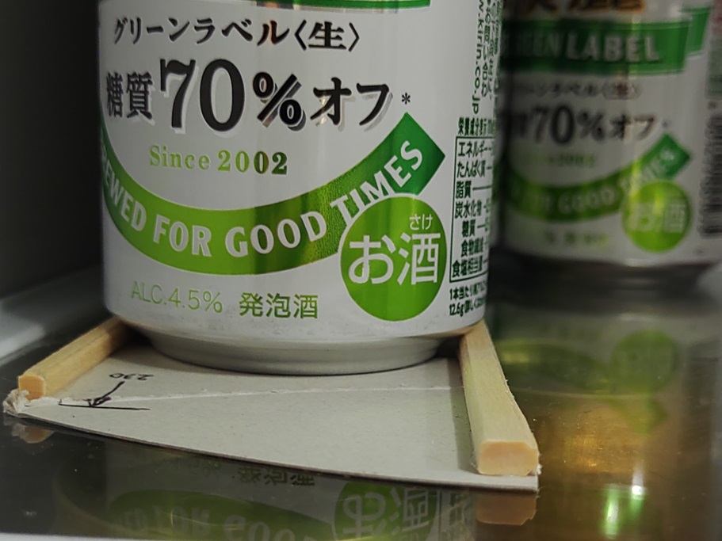

# beer_guide_in_fridge

This is a guide rail for beer cans in the refrigerator; it holds 4 cans and is FIFO (first in, first out), ejecting from the back.

## materials:
- 1.5set splittable wood chopsticks 
-  275x66mm thick paper
- woodworking bond

## Design

<svg xmlns="http://www.w3.org/2000/svg" viewBox="-272 -16 286 130">

<g id="topview" stroke-width=".3" stroke="#888">
    <path id="base_paper" fill="#ccc" d="M-230,0 L0,0 L0,66 L-272,66 Z"/>
    <path id="guide_left" fill="#fec" d="M-230,0 L-27,0 L-27,5 L-230,4 Z" />
    <path id="guide_right" fill="#fcc" d="M-272,61 L-69,62 L-69,66 L-272,66 Z" />
    <path id="guide_back" fill="#fc8" d="M-38,5 L0,68 l0,-8 L-33,5 Z" />
    <g id="guide" stroke="#000" stroke-width=".1" fill="none">
        <path id="v" d="M0,-1 l0,-12" />
        <text x="-11" y="-10" class="small">230</text>
        <path id="230" d="M0,-10 L-230,-10 l10,2 m0,-4 l-10,2 m0,-2 l0,10" />
        <text x="-8" y="-4" class="small">38</text>
        <path id="38"  d="M0,-4 L-38,-4 l10,2 m0,-4 l-10,2 m0,-2 l0,5" />
        <text x="-8" y="45" class="small">69</text>
        <path id="69"  d="M0,45 L-69,45 l10,2 m0,-4 l-10,2 m0,-2 l0,18" />
        <path id="h" d="M1,0 l12,0" />
        <text x="0" y="8" class="small">66</text>
        <path id="66"  d="M3,0 L3,66 l2,-10 m-4,0 l2,10 m2,0 l-4,0" />
        <text x="5" y="74" class="small">68</text>
        <path id="68"  d="M8,0 L8,68 l2,-10 m-4,0 l2,10 m2,0 l-9,0" />
        <text x="-20" y="4" class="small">5</text>
        <path id="5"  d="M-23,12 l0,-7 l1,4 m-2,0 l1,-4 m2,0 l-5,0" />
        <text x="-55" y="65" class="small">4</text>
        <path id="4"  d="M-60,55 l0,7 l1,-4 m-2,0 l1,4 m2,0 l-10,0" />
    </g>
    <g id="cans" stroke-dasharray="2" stroke="#080" fill="none">
        <circle cx="-46" cy="46" r="27" />  <circle cx="-46" cy="46" r="33" />
        <circle cx="-111" cy="33" r="27" />  <circle cx="-111" cy="33" r="33" />
        <circle cx="-177.5" cy="33" r="27" />  <circle cx="-177.5" cy="33" r="33" />
        <circle cx="-244" cy="33" r="27" />  <circle cx="-244" cy="33" r="33" />
    </g>
</g>
<g id="frontview" stroke-width=".3" stroke="#888" transform="translate(0 100)">
    <path id="base_paper" fill="#ccc" d="M-272,0 L0,0 L0,-1 L-272,-1 Z"/>
    <path id="guide_left" fill="#fec" d="M-230,-1 L-27,-1 L-27,-6 L-230,-5 Z" />
    <path id="guide_right" fill="#fcc" d="M-272,-1 L-69,-1 L-69,-5 L-272,-6 Z" />
    <path id="guide_back" fill="#fc8" d="M-38,-1 L0,-1 L0,-5 L-38,-5 Z" />
    <g id="guide" stroke="#000" stroke-width=".1" fill="none">
        <text x="8" y="-1" class="small">4</text>
        <path id="4" d="M4,-12 l0,7 l1,-4 m-2,0 l1,4 m2,0 l-4,0" />
        <path id="5" d="M4,6 l0,-7  l1,4 m-2,0 l1,-4 m2,0 l-4,0" />
    </g>
</g>
</svg>

# Usecase

